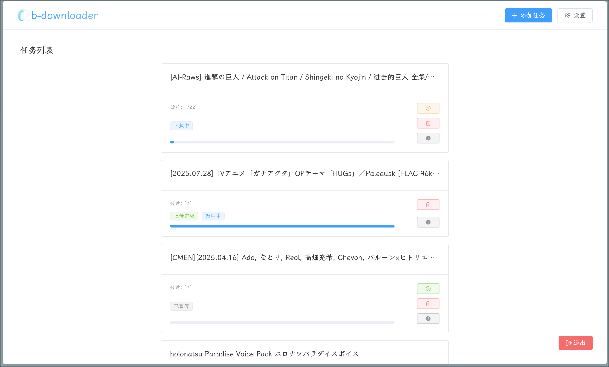

<div align="center">

<h1 style="margin-top: 0">Qb-downloader</h1>

</div>

[中文](README_CN.md)

## Description

Qb-downloader allows you to complete your qBittorrent tasks part by part and upload them to your cloud drive. This enables you to download large torrent tasks even if they exceed your maximum available storage.

Supported uploaders: [Rclone rcd](https://rclone.org/commands/rclone_rcd/)
A typical qb-downloader workflow includes:
1. Splitting the torrent task into multiple parts.
2. Downloading each part sequentially.
3. Running interval tasks between each part, such as seeding, uploading to your cloud drive, etc.

## TODO

- [x] Adding support for customizing torrent contents.
- [ ] Forced continuation when error occurs.
- [x] Improving ui experience.
- [ ] Adding support for hot update.

## Usage

### prerequisite

This tool requires qBittorrent and an uploader to be running. Make sure you have configured them properly.

> [!IMPORTANT]
> make sure you haven't enabled options like "Delete torrent after completion" in your qBittorrent.

Example [rclone rcd](https://rclone.org/commands/rclone_rcd/) service configuration:
```ini
[Unit]
Description=Rclone Remote Control (rcd)
After=network-online.target
Wants=network-online.target

[Service]
Type=simple
ExecStart=/usr/bin/rclone rcd --rc-addr=:5572  --rc-user=admin --rc-pass="password"
User=rclone
Restart=on-failure

[Install]
WantedBy=multi-user.target
```
### Deploy

#### Docker (Recommended)

```yaml
services:
  qb-downloader:
    network_mode: "host"
    container_name: qb-downloader
    environment:
      - PORT=7845
      - CONFIG=/config
    volumes:
      - ./config/qb-downloader:/config
    restart: unless-stopped
    image: uchout/qb-downloader:latest
```
#### Manual installation
Make sure you have a Java Runtime Environment installed.

Download the latest jar file from the [release page](https://github.com/uchouT/qb-downloader/releases/latest), and run qb-downloader with:
```bash
java -jar path/to/qb-downloader.jar
```
qb-downloader will run on port 7845 by default. The initial username is `admin` and the password is `adminadmin`. You can specify a custom port and host using `--port` and `--host` arguments. It's recommended to configure a systemd service for use.

## Acknowledgments

- [ani-rss](https://github.com/wushuo894/ani-rss) - Inspired by and borrowed code from this project
- [hutool](https://hutool.cn)
- [rclone](https://rclone.org)
- [qBittorrent](https://github.com/qbittorrent/qBittorrent)
- [Vue.js](https://cn.vuejs.org/)
- [Lombok](https://github.com/projectlombok/lombok)
- [Logback](https://github.com/qos-ch/logback)
- [Maven](https://github.com/apache/maven)
- [Gson](https://github.com/google/gson)
- [dampcake/bencode](https://github.com/dampcake/bencode)